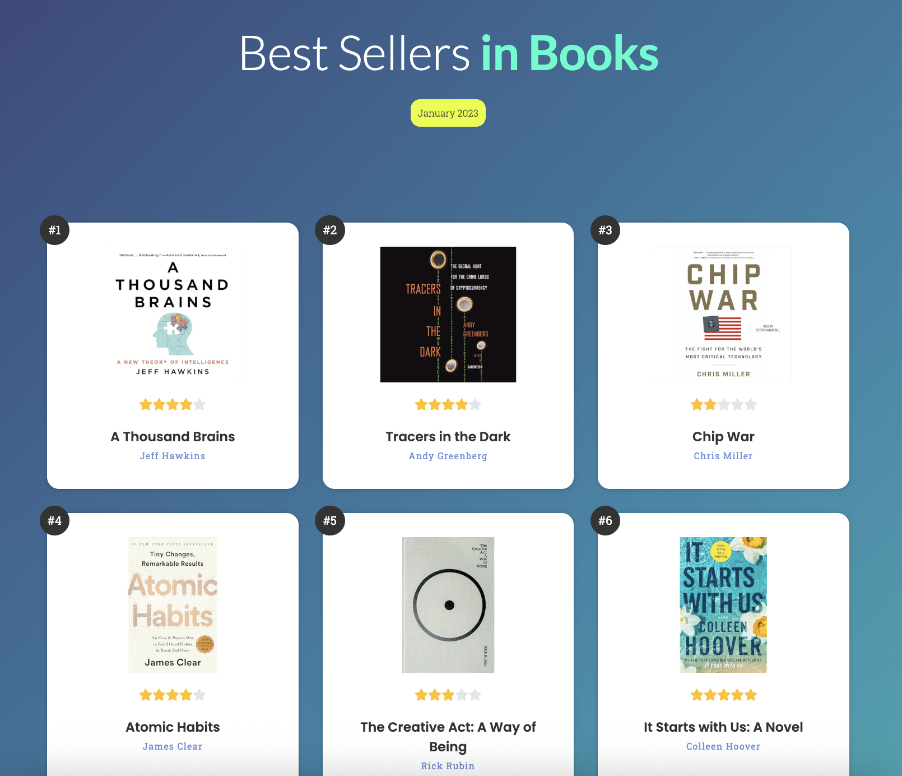

### ﹅ Best sellers in books 📚

This is a simple web application built with React, showing a list of bestselling books. Each book is displayed by its rank, and users can give it a star rating. The goal of the project was to practice building a clean and interactive UI using modern frontend tools.

<br>

### ﹅ Tech Stack

- **Frontend**: React, HTML, CSS

<br>

### ﹅ Preview

   
[Visit website](https://react-amazon-bestsellers-books-dy.netlify.app/)
<br>

### ﹅ Features

- 📘 Books are shown in ranked order
- ⭐ Users can rate each book with a star rating
- 📱 Responsive design for various devices  

<br>

### ﹅ Installation

```bash
git clone https://github.com/dyoungky/Best-sellers-in-books.git
cd ITU-Name
npm install
npm start
